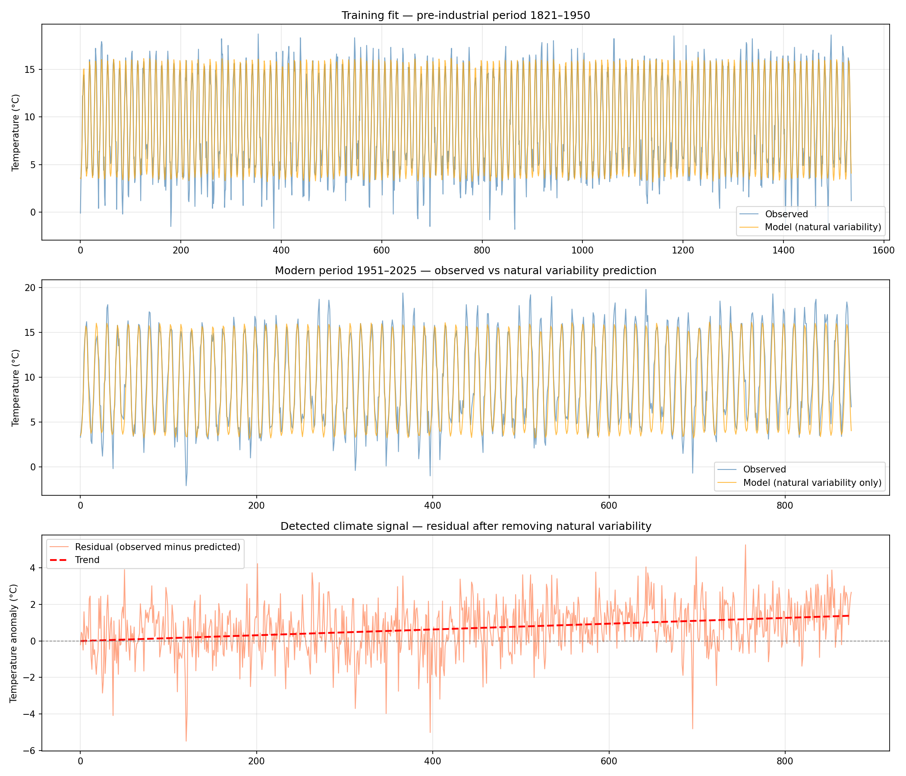

# Climate Signal Detection with LSTM
### Detecting Anthropogenic Warming in the HadCET Record (1659–2025)

A deep learning project applying a Long Short-Term Memory (LSTM) neural network to the world's longest instrumental temperature record to detect and quantify the anthropogenic climate signal embedded in 365 years of UK temperature observations.

**Key result: 0.190°C of warming per decade detected in Central England temperatures from 1951–2025, after accounting for all major natural forcing variables.**

---

## Project Structure

```
climate-signal-detection/
│
├── Data_cleansing.ipynb                          # Data preparation notebook
├── climate_lstm_model.ipynb                      # LSTM model notebook
│
├── Monthly_Temperature_Totals.txt                # HadCET monthly (Met Office)
├── Central_England_Temperature_Daily_Totals.txt  # HadCET daily (Met Office)
├── NAO_Index.csv                                 # North Atlantic Oscillation (CRU)
├── Sunspot_Number_V2_0.csv                       # Solar proxy (SILSO)
├── Global_and_Hemispheric_Mean_Aerosol_Optical_Depth_at_550_nm.csv  # Volcanic aerosols (NASA GISS)
│
├── hadcet_master.csv                             # Merged master dataset
├── hadcet_train.csv                              # Training set (1821–1950)
├── hadcet_test.csv                               # Test set (1951–2025)
│
├── climate_lstm.pt                               # Saved model weights
├── hadcet_overview.png                           # Raw data visualisation
└── climate_signal_detection.png                  # Key results plot
```

---

## Scientific Background

This project is framed around **detection and attribution**,  one of the core research methodologies used by the Met Office and the IPCC to establish that observed climate change is driven by human activity rather than natural variability.

The approach:
1. Train an LSTM exclusively on **pre-industrial data (1821–1950)** using only natural forcing variables — NAO, solar activity, and volcanic aerosols
2. Apply the trained model to **modern data (1951–2025)** without retraining
3. The gap between what the model predicts (natural variability alone) and what was actually observed is the anthropogenic signal

This mirrors real detection and attribution methodology. If natural variability alone explained modern temperatures, the residual would be flat. It is not.

---

## Datasets

| Dataset | Source | Coverage | Resolution |
|---|---|---|---|
| HadCET monthly temperatures | Met Office HadOBS | 1659–2025 | Monthly |
| HadCET daily temperatures | Met Office HadOBS | 1772–2025 | Daily |
| NAO Index | CRU, University of East Anglia | 1821–2025 | Monthly |
| Sunspot number | SILSO, Royal Observatory Belgium | 1818–2026 | Daily → Monthly |
| Stratospheric aerosol optical depth | NASA GISS | 1850–2012 | Monthly |

**HadCET** is the world's longest instrumental temperature series, maintained by the Met Office. Using it for this project was a deliberate choice — it is the flagship dataset of the organisation, this project was built to impress.

---

## Model Architecture

```
ClimateLSTM(
  (lstm): LSTM(5, 64, num_layers=2, batch_first=True, dropout=0.2)
  (fc): Linear(in_features=64, out_features=1, bias=True)
)
Total parameters: 51,521
```

**Input features (5):** NAO index, sunspot number, aerosol optical depth, month_sin, month_cos

**Sequence window:** 24 months, two full annual cycles, giving the model enough context to learn inter-annual NAO variability alongside the seasonal cycle

**Cyclical month encoding:** Month encoded as sine and cosine rather than a raw integer. This ensures the model understands that December and January are climatologically adjacent; a raw integer would treat them as maximally distant.

---

## Training

| Epoch | Train Loss | Test Loss |
|---|---|---|
| 20 | 0.0921 | 0.1104 |
| 60 | 0.0879 | 0.1059 |
| 100 | 0.0872 | 0.1076 |
| 200 | 0.0867 | 0.1076 |

- Optimiser: Adam (lr=1e-3, weight_decay=1e-4)
- Loss: MSE
- Scheduler: ReduceLROnPlateau (patience=10, factor=0.5)
- Train and test losses stayed close throughout — no overfitting
- Converged around epoch 60 and remained stable to epoch 200

---

## Results

**Detected warming trend: 0.190°C per decade**

Over the 75-year test period (1951–2025), this represents approximately **1.4°C of warming** in Central England that natural forcing variables alone cannot explain.

The IPCC AR6 estimates global mean surface warming of ~1.1°C since pre-industrial times. Central England warming slightly faster than the global average is physically expected — land warms faster than ocean. This result is consistent with the Met Office's own detection and attribution findings using the HadCET record.



---

## Challenges and How I Overcame Them

**1. Pandas datetime overflow on 17th century dates**

`pd.to_datetime()` cannot handle dates before 1677, it uses nanosecond precision internally which overflows for earlier dates. The HadCET monthly data goes back to 1659, causing an `OutOfBoundsDatetime` error on the first attempt.

*Fix:* Stored dates as strings in `YYYY-MM` format throughout the pipeline (`"1659-01"`) rather than using pandas datetime objects. This sidesteps the overflow entirely, and the string format still sorts and merges correctly. The daily data only goes back to 1772, so `pd.to_datetime()` was safe to use there.

**2. Inconsistent missing value flags across datasets**

Each dataset used a different sentinel for missing data: HadCET used `-99.9`, NAO used `-99.99`, sunspot used `-1`, and aerosol data had duplicate date entries from decimal month conversion. Leaving any of these in as real values would have completely distorted the model.

*Fix:* Identified each sentinel by inspecting the raw files before loading, replaced all with `np.nan`, and deduped the aerosol data by grouping on date and taking the mean. Forward and backward fill was applied to the 17 remaining NAO gaps in the early 1800s.

**3. Apple Numbers format for two downloaded files**

The NAO and aerosol files downloaded as `.numbers` files (Apple Numbers format) rather than plain CSV, which Python cannot read directly.

*Fix:* Exported both from Numbers to CSV via File → Export To → CSV before uploading.

**4. Notebook kernel state issues**

Several `NameError` crashes occurred mid-session because variables defined in earlier cells were lost when the kernel was restarted or when code was continued in a new notebook.

*Fix:* Separated the project into two clean notebooks. `Data_cleansing.ipynb` for all data preparation, saving outputs to CSV at the end. `climate_lstm_model.ipynb` loads those CSVs fresh at the start. This made each notebook self-contained and eliminated all kernel state dependencies.

**5. Third plot rendering empty**

The climate signal residual plot (Plot 3) rendered as a blank white chart with axes running from 0.0 to 1.0.

*Fix:* The residual values were small floats, and matplotlib defaulted to a 0–1 axis. Added `ax.set_ylim(residual.min() - 0.5, residual.max() + 0.5)` to force the axis to scale to the actual data range.

**6. PyTorch `verbose` argument removed**

`ReduceLROnPlateau(..., verbose=True)` raised a `TypeError` because the `verbose` argument was removed in newer versions of PyTorch.

*Fix:* Removed the `verbose=True` argument. The scheduler works identically without it.

**7. Data leakage risk on scalers**

Initial instinct was to fit `StandardScaler` on the full dataset before splitting. This would have leaked test set statistics into the training process, invalidating all results.

*Fix:* Scalers fitted exclusively on training data using `.fit_transform()`, then applied to test data using `.transform()` only.

---

## Requirements

```
pandas
numpy
matplotlib
scikit-learn
torch
```

Install with:
```bash
pip install pandas numpy matplotlib scikit-learn torch
```

---

## How to Run

1. Clone the repository
2. Run `Data_cleansing.ipynb` end to end — this generates `hadcet_train.csv`, `hadcet_test.csv`, and `hadcet_master.csv`
3. Run `climate_lstm_model.ipynb` end to end — this trains the LSTM and produces the results plots

---

## Skills Demonstrated

Python · Pandas · NumPy · PyTorch · scikit-learn · Matplotlib · time series analysis · LSTM architecture design · climate data processing · detection and attribution methodology · multi-source data merging · feature engineering

---

## Data Sources

- Met Office HadOBS: https://www.metoffice.gov.uk/hadobs/hadcet
- CRU NAO Index: https://crudata.uea.ac.uk/cru/data/nao
- SILSO Sunspot Data: https://www.sidc.be/SILSO/datafiles
- NASA GISS Aerosol Data: [https://giss.nasa.gov/modelforce/strataer](https://data.giss.nasa.gov/modelforce/)
